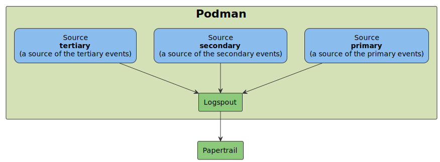

# Logspout Sandbox

This repository contains basic **Logspout** configuration.

To run this example **Podman** installation and some other dependencies like **Papertrail** account is required.

More detailed documentation of the **[Logspout](https://github.com/gliderlabs/logspout)**.

### Integration examples

- **[Papertrail](https://papertrailapp.com)** - make sure `<YOUR_PAPERTRAIL_PORT_NUMBER>` placeholder is replaced with your correct Papertrail port number. 

## Diagram

## Makefile

Use `Makefile` to run all the examples. To list all available options run `make`.

## Instructions

- Run `make up` to start everything up.
- Observe evens on the papertrail dashboard.
