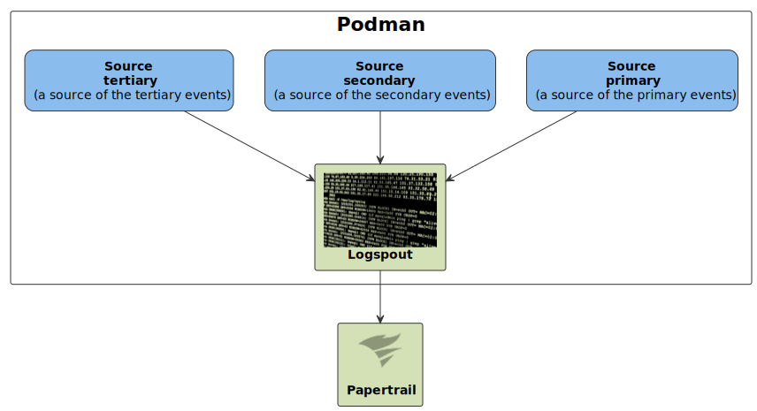
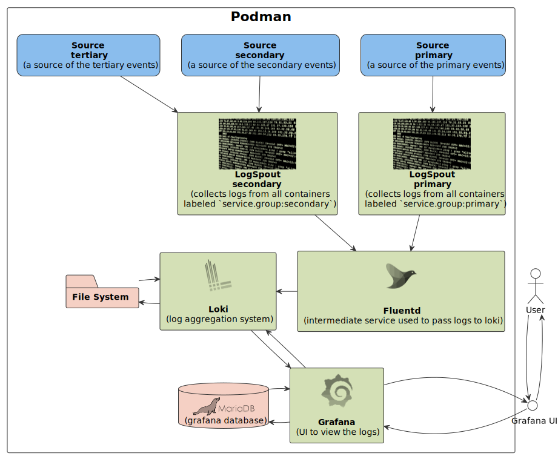

# Logspout Sandbox

This repository contains a few basic **Logspout** configuration examples.

To run this example **Podman** installation and some other dependencies like **Papertrail** account is required.

More detailed documentation of the **[Logspout](https://github.com/gliderlabs/logspout)**.

### Integration examples

- **[Papertrail](https://papertrailapp.com)** - an example showing how to pump logs to an external logs aggregator (make sure `<YOUR_PAPERTRAIL_PORT_NUMBER>` placeholder is replaced with your correct Papertrail port number).
- **Grafana** - an example to show how to direct logs into hosted aggregator and view in **Grafana**.

## Diagram

### Papertrail example

#### Single Logspout

#### Grouping

### Grafana example

This example shows how to group and pass logs through to Grafana, so they can be viewed in the UI.

## Makefile

Use `Makefile` to run all the examples. To list all available options run `make`.

## Instructions

#### Papertrail

- Run `make up-logspout-papertrail` or `up-logspout-grouping-papertrail` to start a specific example up.
- Observe events on the **Papertrail** dashboard.

#### Grafana

- Run `make up-logspout-grafana` to start the whole stack.
- Observe events on the **Grafana** dashboard ([localhost:3000](localhost:3000)).
